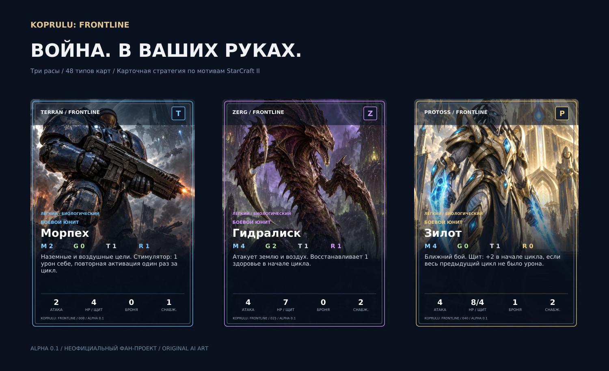

# KOPRULU: FRONTLINE

**Карточная стратегия по мотивам StarCraft II: экономика, производство, разведка и контрсостав трёх рас.**

Неофициальный фан-проект. Рабочий базовый набор **0.1**, замысел полной игры и план разработки. Это карточная адаптация; полное воспроизведение всех механик SC2 пока является целью следующих этапов.



## Что уже готово

- **48 типов карт**, по 16 на расу: экономика, здания, 12 боевых типов, способности и улучшения.
- **15 оригинальных ИИ-иллюстраций**: отдельный арт каждого боевого типа и три сцены баз. Здания и часть тактики используют общую фракционную сцену.
- **48 редактируемых SVG-карт**, три рубашки, ресурсные пиктограммы, поле и жетоны.
- **Два PDF** для домашней печати: карты 63 × 88 мм и вспомогательный комплект.
- Локальный прототип для двух игроков: каталог карт, фильтры, карточные подробности, бой, автосохранение и экспорт снимка партии.
- Детерминированный игровой движок и **21 тест**, включая партию от стандартного старта до победы.

## Запустить

Нужен Node.js 20+ и современный браузер. npm-зависимостей нет.

```bash
git clone https://github.com/mdanshin/StarCraft-.git
cd StarCraft-
node scripts/serve.mjs
```

Откройте `http://localhost:4173`. Можно использовать `npm start`. Открытие `index.html` через `file://` не поддерживается из-за загрузки JSON и модулей.

В разделе **«Схватка»** выберите расы и нажмите «Новая партия». Каждый игрок получает по три приказа на цикл, поочерёдно. Начните с производства и рабочих; для газовых войск понадобится добывающее газ здание и назначенные рабочие. Выберите свою единицу, затем сектор либо вражескую цель, после чего отдайте приказ. Для первого знакомства отключите туман войны. Победа — уничтожить все здания противника.

## Правила и план

| Документ | Содержание |
| --- | --- |
| [Правила 0.1](docs/RULES.md) | Полный порядок игры, экономика, бой, способности, пример старта |
| [Замысел полной игры](docs/DESIGN.md) | Как передать параллельность RTS, полные расовые механики и микроконтроль |
| [Матрица механик](docs/MECHANICS.md) | Что реализовано, что упрощено, что спроектировано |
| [План разработки](docs/ROADMAP.md) | Этапы, порядок ростера, плейтесты и критерии готовности |
| [Художественное руководство](docs/ART-DIRECTION.md) | Стиль, состав графики, редактирование и печать |
| [Архитектура](docs/ARCHITECTURE.md) | Код, данные, детерминированность и будущая сетевая игра |
| [Проверка](docs/VALIDATION.md) | Выполненные проверки и ограничения среды |

## Печатный комплект и графика

- [48 карт — PDF](print/cards.pdf): шесть страниц A4, по одному экземпляру типа.
- [Поле, жетоны, рубашки и памятка — PDF](print/board-and-tokens.pdf): пять страниц.
- [SVG-карты](assets/cards) · [Рубашки](assets/backs) · [Иллюстрации](assets/art).
- [Все точные промпты ImageGen](assets/manifest.json).

Печатайте в масштабе **100%**, без подгонки. PDF предназначены для одностороннего print-and-play, не размечены для автоматического дуплекса. Повторные единицы обозначайте номерными жетонами и реестром: число справочных карт не ограничивает производство. Для зеркальной партии нужен второй справочник расы или общая библиотека с отдельными реестрами.

## Проверить и редактировать

```bash
node --test tests/engine.test.mjs
node scripts/make-data.mjs
```

Параметры карт задаются в `scripts/make-data.mjs`, который обновляет `data/cards.json` и `data/factions.json`. После изменения параметров пересоберите печатные материалы:

```bash
python3 -m pip install reportlab pillow matplotlib
python3 scripts/render-print.py
```

Python нужен только для пересборки графики/PDF, готовая игра работает без него. SVG используют относительные ссылки на `assets/art`; сохраняйте структуру каталогов.

## Границы текущей версии

В 0.1 работают минералы/газ, рабочие, конечные запасы, стройка, очереди, резерв снабжения, технологии, экспанды, пространственный бой, воздух, броня/щиты, регенерация, слизь, личинки, инъекция, скан, закапывание, осада, стимулятор, скачок, шторм, ремонт и улучшения.

Сетевой режим, AI-соперник, полные ростеры и деревья технологий, транспорт, самостоятельные кастеры, маскировка и все морфы ещё не реализованы. Энергия и часть расовой поддержки объединены в общий пул для обучения. Туман фильтрует экран, но всё состояние находится в локальном браузере. Баланс требует живых плейтестов; прохождение тестов не доказывает равенство рас.

Официальный [протокол Blizzard](https://github.com/Blizzard/s2client-proto) использован как технический ориентир по классам состояния. Карточные числа и эффекты — собственная адаптация, а не таблица текущего баланса StarCraft II.

Сведения о происхождении и обозначении фан-проекта: [NOTICE.md](NOTICE.md).
